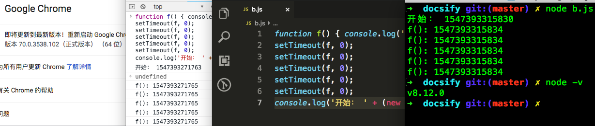
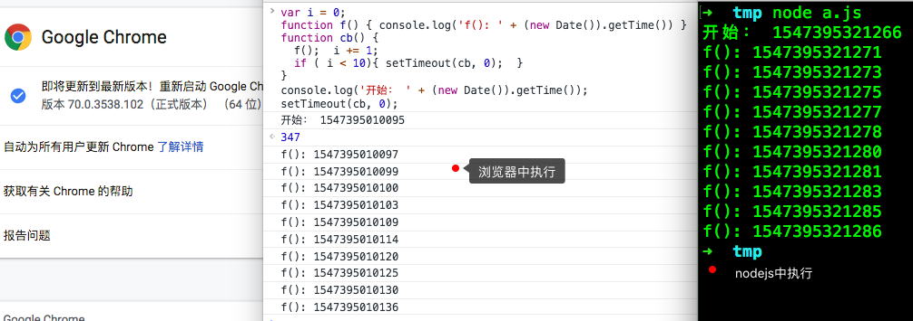

## 1. setTimeout、setInterval

setTimeout()方法设置一个定时器，该定时器在定时器到期后执行一个函数或指定的一段代码。

setInterval() 方法重复调用一个函数或执行一个代码段，在每次调用之间具有固定的时间延迟。

setTimeout的用法(setInterval用法一样)：

```javascript
function f() { console.log('f') }
function t(a) { console.log(a) }
setTimeout(f, 0);
setTimeout(f, 1000);
setTimeout(t, 0, 'hello');
var id = setTimeout(t, 1000, '我不会被执行');
setTimeout("console.log('类似evel方法')"); // nodejs中此处会报错
clearTimeout(id)	// 取消了setTimeout函数的回调
```

参数(setTimeout、setInterval一样)：

> 第一个参数(必填)：带执行的函数，也可以使用字符串代替函数，在`delay`毫秒之后执行字符串 (使用该语法是**不推荐的,** 原因和使用`eval`一样，有安全风险)
>
> 第二个参数(可选)：延迟的毫秒数 (一秒等于1000毫秒)，函数的调用会在该延迟之后发生。如果省略该参数，delay取默认值0。实际的延迟时间可能会比 delay 值长
>
> 第三个以后的参数(可选)：执行函数的参数

返回值

> 返回一个正整数，表示定时器的编号。
>
> 这个值传递给`clearTimeout()`可以用来来取消setTimeout的定时。
>
> 这个值传递给`clearInterval()`可以用来来取消setInterval的定时。

***注意：***IE9 及更早的 IE 浏览器不支持向延迟函数传递额外参数的功能。

### 1.1 关于延迟

https://html.spec.whatwg.org/multipage/timers-and-user-prompts.html#timers

目前看到的文档关于setTimeout第二个参数的说明：

> If timeout is less than 0, then set timeout to 0.
>
> If nesting level is greater than 5, and timeout is less than 4, then set timeout to 4.
>
> 翻译成中文：
>
> 如果timeout小于0，则将timeout设置为0。
>
> 如果嵌套级别大于5，并且超时小于4，则将超时设置为4。


1、如果JavaScript中没有耗时久的代码，并且setTimeout函数延迟是0的话，那么在浏览器中和nodejs中都是会立刻就执行的：

```javascript
function f() { console.log('f(): ' + (new Date()).getTime()) }
setTimeout(f, 0);
setTimeout(f, 0);
setTimeout(f, 0);
setTimeout(f, 0);
setTimeout(f, 0);
console.log('开始： ' + (new Date()).getTime());
```

下面的图片分别是在浏览器中和nodejs中的输出结果。



2、如果JavaScript同步代码有耗时的代码，那么setTimeout回调函数执行的时间就会大于设置的时间：

```javascript
function f() { console.log('f(): ' + (new Date()).getTime()) }
setTimeout(f, 0);
var t = (new Date()).getTime()
console.log('开始： ' + t);
while(true){
  if (t < (new Date()).getTime() - 3000) {
    break;
  }
}
// 输出结果
// 开始： 1547394071675
// f(): 1547394074677
```

可以看到上面的setTimeout回调函数要在3秒以后才能执行

3、如果setTimeout有超过5层以上的嵌套

```javascript
var i = 0;
function f() { console.log('f(): ' + (new Date()).getTime()) }
function cb() { 
  f();  i += 1;
  if ( i < 10){ setTimeout(cb, 0);  }
}
console.log('开始： ' + (new Date()).getTime());
setTimeout(cb, 0);
```

通过实际运行结果可以看见，在浏览器中第五次以后执行会大于4毫秒。

nodejs是最少间隔1毫秒执行一次。




## 2. setImmediate()

此方法是一个特殊timer，目前在nodejs得到支持，在浏览器环境还没有成为标准，在Google浏览器(70版本)中还不支持，

在nodejs中etImmediate()是放在`check`阶段执行的

```javascript
setImmediate(function(a, b) {
  console.log('setImmediate:'+ a + b)
}, 5000, 'hello') 
// setImmediate:5000hello
```

***注意：***setImmediate不能设置延迟时间，setImmediate第一个参数是回调函数，后面的参数是回调函数的参数。

```javascript
setTimeout(function() {
  console.log('setTimeout')
}, 0)
setImmediate(function() {
  console.log('setImmediate')
})  
```

setTimeout和setImmediate在nodejs有时输出顺序不一致。

setTimeout与setImmediate先后入队之后，首先进入的是`timers`阶段，如果我们的机器性能一般或者加入了一个同步长耗时操作，那么进入`timers`阶段，1ms已经过去了，那么setTimeout的回调会首先执行。 
如果没有到1ms，那么在`timers`阶段的时候，超时时间没到，setTimeout回调不执行，事件循环来到了`poll`阶段，这个时候队列为空，此时有代码被setImmediate()，于是先执行了setImmediate()的回调函数，之后在下一个事件循环再执行setTimemout的回调函数。

## 3. process.nextTick()

process.nextTick()方法目前只在nodejs中支持。

有时我们想要立即异步执行一个任务，可能会使用延时为0的定时器，但是这样开销很大。我们可以换而使用`process.nextTick()`，它会将传入的回调放入`nextTickQueue`队列中,不管事件循环进行到什么地步，都在当前**执行栈**的操作结束的时候调用。这点很重要，注意。

process.nextTick方法指定的回调函数，总是在**当前执行队列**的尾部触发，多个process.nextTick语句总是一次执行完（不管它们是否嵌套），递归调用process.nextTick，将会没完没了，主线程根本不会去读取事件队列，导致**阻塞后续调用**，直至达到最大调用限制。

相比于在定时器中采用红黑树树的操作时间复杂度为0(lg(n))，而`process.nextTick()`的时间复杂度为0(1)，相比之下更高效。

一个例子：

```javascript
setTimeout(() => {
  process.nextTick(() => console.log('nextTick1'))
  setTimeout(() => {
    console.log('setTimout1')
    process.nextTick(() => {
      console.log('nextTick2')
      setImmediate(() => console.log('setImmediate1'))
      process.nextTick(() => console.log('nextTick3'))
    })
    setImmediate(() => console.log('setImmediate2'))
    process.nextTick(() => console.log('nextTick4'))
    console.log('sync2')
    setTimeout(() => console.log('setTimout2'), 0)
  }, 0)
  console.log('sync1')
}, 0)

// sync1 nextTick1 setTimout1 sync2 nextTick2 nextTick4 nextTick3 setImmediate2 setImmediate1 setTimout2
```

## 4. Promise

Promise 是异步编程的一种解决方案，比传统的解决方案——回调函数和事件——更合理和更强大。它由社区最早提出和实现，ES6 将其写进了语言标准，统一了用法，原生提供了`Promise`对象。

Promise 是一个对象，从它可以获取异步操作的消息。Promise 提供统一的 API，各种异步操作都可以用同样的方法进行处理。

`Promise`对象有以下两个特点:

- 对象的状态不受外界影响。`Promise`对象代表一个异步操作，有三种状态：`pending`（进行中）、`fulfilled`（已成功）和`rejected`（已失败）。只有异步操作的结果，可以决定当前是哪一种状态，任何其他操作都无法改变这个状态。
- 一旦状态改变，就不会再变，任何时候都可以得到这个结果。`Promise`对象的状态改变，只有两种可能：从`pending`变为`fulfilled`和从`pending`变为`rejected`。只要这两种情况发生，状态就凝固了，不会再变了，会一直保持这个结果，这时就称为 resolved（已定型）。如果改变已经发生了，你再对`Promise`对象添加回调函数，也会立即得到这个结果。这与事件（Event）完全不同，事件的特点是，如果你错过了它，再去监听，是得不到结果的。

有了`Promise`对象，就可以将异步操作以同步操作的流程表达出来，避免了层层嵌套的回调函数。此外，`Promise`对象提供统一的接口，使得控制异步操作更加容易。

`Promise`也有一些缺点:

- 无法取消`Promise`，一旦新建它就会立即执行，无法中途取消
- 如果不设置回调函数，`Promise`内部抛出的错误，不会反应到外部
- 当处于`pending`状态时，无法得知目前进展到哪一个阶段（刚刚开始还是即将完成）

### 4.1 创建一个Promise实例

```javascript
const promise = new Promise(function(resolve, reject) {
  // ... 一些操作
  
  if (/* 异步操作成功 */){
    // 如果请求成功了，把执行结果传给resolve回调
    resolve(value);
  } else {
    // 如果请求失败而，把错误信息传给reject回调
    reject(error);
  }
});
```

`Promise`构造函数接受一个函数作为参数，该函数的两个参数分别是`resolve`和`reject`。它们是两个函数，由 JavaScript 引擎提供，不用自己部署。

> resolve函数作用：将`Promise`对象的状态从“未完成”变为“成功”（即从 pending 变为 resolved），在异步操作成功时调用，并将异步操作的结果，作为参数传递出去；
>
> reject函数作用：将`Promise`对象的状态从“未完成”变为“失败”（即从 pending 变为 rejected），在异步操作失败时调用，并将异步操作报出的错误，作为参数传递出去。

### 4.2 使用Promise

```javascript
// 第一种使用方式
promise.then(function(value) {
  // 请求成功时执行这里，也就是执行resolve(value)后，会回调这个函数处理
}, function(error) {
  // 请求失败或报错执行这里，也就是执行reject(error)后，会回调这个函数处理
});

// 第二种使用方式
promise.then(function(value) {
   // 请求成功时执行这里，也就是执行resolve(value)后，会回调这个函数处理
}).catch(function(error) {
   // 请求失败或报错执行这里，也就是执行reject(error)后，会回调这个函数处理
});
```

使用第一种方式：

> `then`方法接受两个回调函数作为参数：
>
> - 第一个回调函数：请求成功时(Promise对象状态变为resolved)调用，参数是Promise对象传出的值
> - 第二个回调函数(可选的)：请求失败(Promise对象状态变为rejected)或报错时调用，参数是Promise对象传出的值
> - 不推荐使用此种方式

使用第二种方式

> `then`方法接受一个回调函数，该回调函数会在请求成功时(Promise对象状态变为resolved)调用，参数是Promise对象传出的值
>
> `catch`方法接受一个回调函数，该回调函数会在请求成功时(Promise对象状态变为rejected)或报错时调用，参数是Promise对象传出的值
>
> 推荐使用这种方式调用

一个使用Promise对象的简单例子：

```javascript
function timeout(flag) {
  return new Promise((resolve, reject) => {
    if (flag) { resolve('正常返回结果') }
    else { reject('报错'); }
  });
}

var a = timeout(true)
a.then((value) => { console.log('一号：', value); });
timeout(false)
.then((value) => { console.log(value); })
.catch((err) => { console.log('二号：', err); })

// 输出结果：
// 一号： 正常返回结果
// 二号： 报错
```


## 参考资料

https://html.spec.whatwg.org/multipage/timers-and-user-prompts.html#timers

[window.setTimeout MDN](https://developer.mozilla.org/zh-CN/docs/Web/API/Window/setTimeout)

[setInterval MDN](https://developer.mozilla.org/zh-CN/docs/Web/API/Window/setInterval)

[Timer nodejs官网](https://nodejs.org/api/timers.html)

[Node.js Event Loop nodejs官网](https://nodejs.org/en/docs/guides/event-loop-timers-and-nexttick/#process-nexttick)

[Node中的事件循环和异步API segmentfault](https://segmentfault.com/a/1190000012648569)

[【翻译】Promises/A+规范 图灵](http://www.ituring.com.cn/article/66566)

[Promise 对象 阮一峰](http://es6.ruanyifeng.com/#docs/promise)

