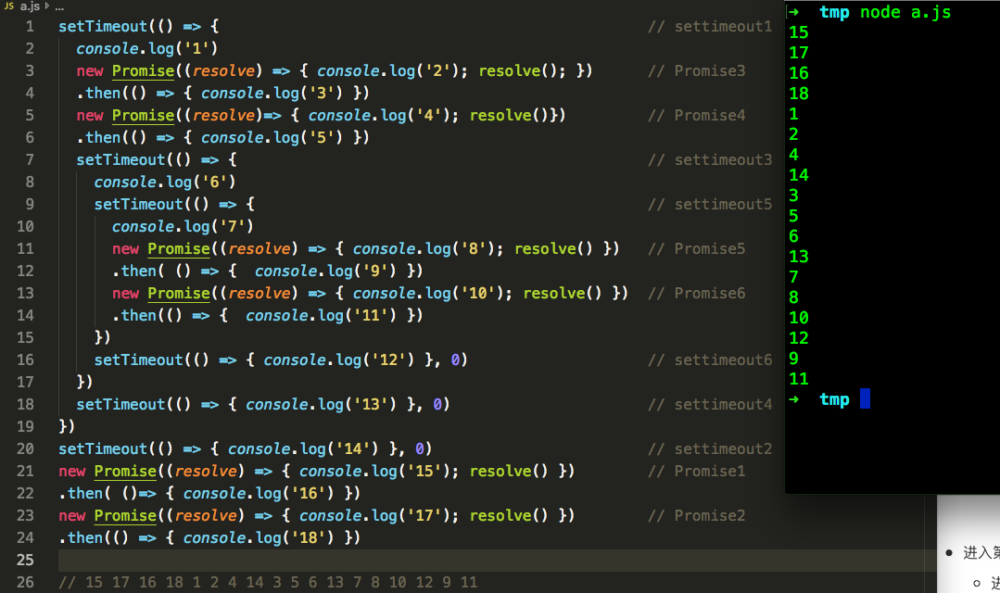

## 1. 说明

本文大部分参考了：https://blog.csdn.net/i10630226/article/details/81369841

nodejs是单线程执行的，同时它又是基于事件驱动的非阻塞IO编程模型。这就使得我们不用等待异步操作结果返回，就可以继续往下执行代码。当异步事件触发之后，就会通知主线程，主线程执行相应事件的回调。

本篇文章讲解node中JavaScript的代码的执行流程，下面是测试代码，如果你知道输出的结果，那么就不需要再看本篇文章，如果不知道输出结果，那么本片文章可帮助你了解：

```javascript
console.log(1)
setTimeout(function () {
  new Promise(function (resolve) {
    console.log(2)
    resolve()
  })
  .then(() => { console.log(3) })
})
setTimeout(function () {
  console.log(4)
})
```

复杂的：

```javascript
setTimeout(() => {
  console.log('1')
  new Promise((resolve) => { console.log('2'); resolve(); })
  .then(() => { console.log('3') })
  new Promise((resolve)=> { console.log('4'); resolve()})
  .then(() => { console.log('5') })
  setTimeout(() => { 
    console.log('6')
    setTimeout(() => {
      console.log('7')
      new Promise((resolve) => { console.log('8'); resolve() })
      .then( () => {  console.log('9') })
      new Promise((resolve) => { console.log('10'); resolve() })
      .then(() => {  console.log('11') })
    })
    setTimeout(() => { console.log('12') }, 0)
  })
  setTimeout(() => { console.log('13') }, 0)
})
setTimeout(() => { console.log('14') }, 0)
new Promise((resolve) => { console.log('15'); resolve() })
.then( ()=> { console.log('16') })
new Promise((resolve) => { console.log('17'); resolve() })
.then(() => { console.log('18') })
```

## 2. nodejs的启动过程

node.js启动过程可以分为以下步骤：

1. 调用platformInit方法 ，初始化 nodejs 的运行环境。

2. 调用 performance_node_start 方法，对 nodejs 进行性能统计。

3. openssl设置的判断。

4. 调用v8_platform.Initialize，初始化 libuv 线程池。

5. 调用 V8::Initialize，初始化 V8 环境。

6. 创建一个nodejs运行实例。

7. 启动上一步创建好的实例。

8. 开始执行js文件，同步代码执行完毕后，进入事件循环。

9. 在没有任何可监听的事件时，销毁 nodejs 实例，程序执行完毕。


## 3. nodejs的事件循环详解

Nodejs 将消息循环又细分为 6 个阶段(官方叫做 Phase), 每个阶段都会有一个类似于队列的结构, 存储着该阶段需要处理的回调函数.

Nodejs 为了防止某个 阶段 任务太多, 导致后续的 阶段 发生饥饿的现象, 所以消息循环的每一个迭代(iterate) 中, 每个 阶段 执行回调都有个最大数量. 如果超过数量的话也会强行结束当前 阶段而进入下一个 阶段. 这一条规则适用于消息循环中的每一个 阶段.

### 3.1 Timer 阶段

这是消息循环的第一个阶段, 用一个 `for` 循环处理所有 `setTimeout` 和 `setInterval` 的回调. 

这些回调被保存在一个最小堆(min heap) 中. 这样引擎只需要每次判断头元素, 如果符合条件就拿出来执行, 直到遇到一个不符合条件或者队列空了, 才结束 Timer Phase.

Timer 阶段中判断某个回调是否符合条件的方法也很简单. 消息循环每次进入 Timer 的时候都会保存一下当时的系统时间,然后只要看上述最小堆中的回调函数设置的启动时间是否超过进入 Timer 时保存的时间, 如果超过就拿出来执行.

### 3.2 Pending I/O Callback 阶段


执行除了`close callbacks`、`setTimeout()`、`setInterval()`、`setImmediate()`回调之外几乎所有回调，比如说`TCP连接发生错误`、 `fs.read`, `socket` 等 IO 操作的回调函数, 同时也包括各种 error 的回调.

### 3.3 Idle, Prepare 阶段

系统内部的一些调用。

### 3.4 Poll 阶段，重要阶段

这是整个消息循环中最重要的一个 阶段, 作用是等待异步请求和数据，因为它支撑了整个消息循环机制.

poll阶段有两个主要的功能：一是执行下限时间已经达到的timers的回调，一是处理poll队列里的事件。
***注：***Node的很多API都是基于事件订阅完成的，比如fs.readFile，这些回调应该都在`poll`阶段完成。

当事件循环进入poll阶段：

- `poll`队列不为空的时候，事件循环肯定是先遍历队列并同步执行回调，直到队列清空或执行回调数达到系统上限。
- `poll`队列为空的时候，这里有两种情况。
  - 如果代码已经被`setImmediate()`设定了回调，那么事件循环直接结束`poll`阶段进入`check`阶段来执行`check`队列里的回调。
  - 如果代码没有被设定`setImmediate()`设定回调：
    - 如果有被设定的timers，那么此时事件循环会检查timers，如果有一个或多个timers下限时间已经到达，那么事件循环将绕回timers阶段，并执行timers的有效回调队列。
    - 如果没有被设定timers，这个时候事件循环是**阻塞**在poll阶段等待事件回调被加入poll队列。

Poll阶段，当js层代码注册的事件回调都没有返回的时候，事件循环会暂时阻塞在poll阶段，解除阻塞的条件：

> 1. 在poll阶段执行的时候，会传入一个timeout超时时间，该超时时间就是poll阶段的最大阻塞时间。
>
> 2. timeout时间未到的时候，如果有事件返回，就执行该事件注册的回调函数。timeout超时时间到了，则退出poll阶段，执行下一个阶段。
>
> 这个 timeout 设置为多少合适呢? 答案就是 Timer Phase 中最近要执行的回调启动时间到现在的差值, 假设这个差值是 detal. 因为 Poll Phase 后面没有等待执行的回调了. 所以这里最多等待 delta 时长, 如果期间有事件唤醒了消息循环, 那么就继续下一个 Phase 的工作; 如果期间什么都没发生, 那么到了 timeout 后, 消息循环依然要进入后面的 Phase, 让下一个迭代的 Timer Phase 也能够得到执行. 
> Nodejs 就是通过 Poll Phase, 对 IO 事件的等待和内核异步事件的到达来驱动整个消息循环的.

### 3.5 Check  阶段

这个阶段只处理 setImmediate 的回调函数. 
那么为什么这里要有专门一个处理 setImmediate 的 阶段 呢? 简单来说, 是因为 Poll 阶段可能设置一些回调, 希望在 Poll 阶段 后运行. 所以在 Poll 阶段 后面增加了这个 Check 阶段.


### 3.6 Close Callbacks 阶段

专门处理一些 close 类型的回调. 比如 `socket.on('close', ...)`. 用于资源清理.


## 4. nodejs执行JS代码过程及事件循环过程


- 1、node初始化

  - 初始化node环境
  - 执行输入的代码
  - 执行`process.nextTick`回调
  - 执行微任务(microtasks)

- 2、进入事件循环

  - 2.1、进入`Timer`阶段

    - 检查`Timer`队列是否有到期的`Timer`的回调，如果有，将到期的所有`Timer`回调按照`TimerId`升序执行
    - 检查是否有`process.nextTick`任务，如果有，全部执行
    - 检查是否有微任务(promise)，如果有，全部执行
    - 退出该阶段

  - 2.2、进入`Pending I/O Callback`阶段

    - 检查是否有`Pending I/O Callback`的回调，如果有，执行回调。**如果没有退出该阶段**
    - 检查是否有`process.nextTick`任务，如果有，全部执行
    - 检查是否有微任务(promise)，如果有，全部执行
    - 退出该阶段

  - 2.3、进入`idle，prepare`阶段

    这个阶段与JavaScript关系不大，略过

  - 2.4、进入`Poll`阶段

    - 首先检查是否存在尚未完成的回调，如果存在，分如下两种情况：

      - 第一种情况：有可执行的回调
        - 执行所有可用回调(包含到期的定时器还有一些IO事件等)
        - 检查是否有`process.nextTick`任务，如果有，全部执行
        - 检查是否有微任务(promise)，如果有，全部执行
        - 退出该阶段
      - 第二种情况：没有可执行的回调
        - 检查是否有`immediate`回调，如果有，退出Poll阶段。如果没有，阻塞在此阶段，等待新的事件通知
    - 如果不存在尚未完成的回调，退出Poll阶段

  - 2.5、进入`check`阶段

    - 如果有immediate回调，则执行所有immediate回调
    - 检查是否有`process.nextTick`任务，如果有，全部执行
    - 检查是否有微任务(promise)，如果有，全部执行
    - 退出该阶段

  - 2.6、进入`closing`阶段

    - 如果有immediate回调，则执行所有immediate回调
    - 检查是否有`process.nextTick`任务，如果有，全部执行
    - 检查是否有微任务(promise)，如果有，全部执行
    - 退出该阶段

- 3、检查是否有活跃的`handles(定时器、IO等事件句柄)`

    - 如果有，继续下一轮事件循环
    - 如果没有，结束事件循环，退出程序

***注意：***

事件循环的每一个子阶段退出之前都会按顺序执行如下过程：

- 检查是否有 process.nextTick 回调，如果有，全部执行。
- 检查是否有 微任务(promise)，如果有，全部执行。


### 4.1 关于Promise和process.nextTick

事件循环队列先保证所有的`process.nextTick`回调，然后将所有的`Promise`回调追加在后面，最终在每个阶段结束的时候一次性拿出来执行。

此外，`process.nextTick`和`Promise`回调的数量是受限制的，也就是说，如果一直往这个队列中加入回调，那么整个事件循环就会被`卡住`。


### 4.2 关于setTimeout(…, 0) 和 setImmediate

这两个方法的回调到底谁快？

如下面的例子：

```javascript
setImmediate(() => console.log(2))
setTimeout(() => console.log(1))
```

使用nodejs多次执行后，发现输出结果有时是`1 2`,有时是`2 1`。

对于多次执行输出结果不同，需要了解事件循环的基础问题。

首先,Nodejs启动,初始化环境后加载我们的JS代码(index.js).发生了两件事(此时尚未进入消息循环环节):

> setImmediate 向 Check 阶段 中添加了回调 console.log(2); 
>
> setTimeout 向 Timer 阶段 中添加了回调 console.log(1)

这时候, 要初始化阶段完毕, 要进入 Nodejs 消息循环了。

为什么会有两种输出呢? 接下来一步很关键:

当执行到 Timer 阶段 时, 会发生两种可能. 因为每一轮迭代刚刚进入 Timer 阶段 时会取系统时间保存起来, 以 ms(毫秒) 为最小单位.

如果 Timer 阶段 中回调预设的时间 > 消息循环所保存的时间, 则执行 Timer 阶段 中的该回调. 这种情况下先输出 1, 直到 Check 阶段 执行后,输出2.总的来说, 结果是 1 2.

如果运行比较快, Timer 阶段 中回调预设的时间可能刚好等于消息循环所保存的时间, 这种情况下, Timer 阶段 中的回调得不到执行, 则继续下一个 阶段. 直到 Check 阶段, 输出 2. 然后等下一轮迭代的 Timer 阶段, 这时的时间一定是满足 Timer 阶段 中回调预设的时间 > 消息循环所保存的时间 , 所以 console.log(1) 得到执行, 输出 1. 总的来说, 结果就是 2 1.

所以, 输出不稳定的原因就取决于进入 Timer 阶段 的时间是否和执行 setTimeout 的时间在 1ms 内. 如果把代码改成如下, 则一定会得到稳定的输出:

```javascript
require('fs').readFile('my-file-path.txt', () => {
 setImmediate(() => console.log(2))
 setTimeout(() => console.log(1))
});
```

这是因为消息循环在 `Pneding I/O Phase` 才向 Timer 和 Check 队列插入回调. 这时按照消息循环的执行顺序, Check 一定在 Timer 之前执行。

从性能角度讲, setTimeout 的处理是在 Timer Phase, 其中 min heap 保存了 timer 的回调, 因此每执行一个回调的同时都会涉及到堆调整. 而 setImmediate 仅仅是清空一个队列. 效率自然会高很多.

再从执行时机上讲. setTimeout(..., 0) 和 setImmediate 完全属于两个阶段.

## 5. 一个实际例子演示

下面以一段代码来说明nodejs运行JavaScript的机制。

如下面一段代码：

```javascript
setTimeout(() => {                                                // settimeout1
  console.log('1')
  new Promise((resolve) => { console.log('2'); resolve(); })      // Promise3
  .then(() => { console.log('3') })
  new Promise((resolve)=> { console.log('4'); resolve()})         // Promise4
  .then(() => { console.log('5') })
  setTimeout(() => {                                              // settimeout3
    console.log('6')
    setTimeout(() => {                                            // settimeout5
      console.log('7')
      new Promise((resolve) => { console.log('8'); resolve() })   // Promise5
      .then( () => {  console.log('9') })
      new Promise((resolve) => { console.log('10'); resolve() })  // Promise6
      .then(() => {  console.log('11') })
    })
    setTimeout(() => { console.log('12') }, 0)                    // settimeout6
  })
  setTimeout(() => { console.log('13') }, 0)                      // settimeout4
})
setTimeout(() => { console.log('14') }, 0)                        // settimeout2
new Promise((resolve) => { console.log('15'); resolve() })        // Promise1
.then( ()=> { console.log('16') })
new Promise((resolve) => { console.log('17'); resolve() })        // Promise2
.then(() => { console.log('18') })
```

上面代码执行过程：

- node初始化
  - 执行JavaScript代码
    - 遇到`setTimeout`, 把回调函数放到`Timer`队列中，记为settimeout1
    - 遇到`setTimeout`, 把回调函数放到`Timer`队列中，记为settimeout2
    - 遇到`Promise`，执行，输出15，把回调函数放到`微任务`队列，记为Promise1
    - 遇到`Promise`，执行，输出17，把回调函数放到`微任务`队列，记为Promise2
    - 代码执行结束，此阶段输出结果：`15 17`
  - 没有`process.nextTick`回调，略过
  - 执行微任务
    - 检查微任务队列是否有可执行回调，此时队列有2个回调：Promise1、Promise2
    - 执行Promise1回调，输出16
    - 执行Promise2回调，输出18
    - 此阶段输出结果：`16 18`
- 进入第一次事件循环
  - 进入Timer阶段
    - 检查Timer队列是否有可执行的回调，此时队列有2个回调：settimeout1、settimeout2
    - 执行settimeout1回调：
      - 输出1、2、4
      - 添加了2个微任务，记为Promise3、Promise4
      - 添加了2个Timer任务，记为settimeout3、settimeout4
    - 执行settimeout2回调，输出14
    - Timer队列任务执行完毕
    - 没有`process.nextTick`回调，略过
    - 检查微任务队列是否有可执行回调，此时队列有2个回调：Promise3、Promise4
    - 按顺序执行2个微任务，输出3、5
    - 此阶段输出结果：`1 2 4 14 3 5`
  - Pending I/O Callback阶段没有任务，略过
  - 进入Pol阶段
    - 检查是否存在尚未完成的回调，此时有2个回调：settimeout3、settimeout4
    - 执行settimeout3回调
      - 输出6
      - 添加了2个Timer任务，记为settimeout5、settimeout6
    - 执行settimeout4回调，输出13
    - 没有`process.nextTick`回调，略过
    - 没有微任务，略过
    - 此阶段输出结果：`6 13`
  - check、closing阶段没有任务，略过
  - 检查是否还有活跃的`handles(定时器、IO等事件句柄)`,有，继续下一轮事件循环
- 进入第二次事件循环
  - 进入Timer阶段
    - 检查Timer队列是否有可执行的回调，此时队列有2个回调：settimeout5、settimeout6
    - 执行settimeout5回调：
      - 输出7、 8、10
      - 添加了2个微任务，记为Promise5、Promise6
    - 执行settimeout6回调，输出12
    - 没有`process.nextTick`回调，略过
    - 检查微任务队列是否有可执行回调，此时队列有2个回调：Promise5、Promise6
    - 按顺序执行2个微任务，输出9、11
    - 此阶段输出结果：`7 8 10 12 9 11`
  - Pending I/O Callback、Poll、check、closing阶段没有任务，略过
  - 检查是否还有活跃的`handles(定时器、IO等事件句柄)`,没有了，结束事件循环，退出程序
- 程序执行结束，输出结果：`15 17 16 18 1 2 4 14 3 5 6 13 7 8 10 12 9 11`





## 参考资料

[深入分析Node.js事件循环与消息队列](https://blog.csdn.net/i10630226/article/details/81369841)

[剖析nodejs的事件循环](https://juejin.im/post/5af1413ef265da0b851cce80)

[Node中的事件循环和异步API](https://segmentfault.com/a/1190000012648569)

[Node.js Event Loop nodejs官网](https://nodejs.org/en/docs/guides/event-loop-timers-and-nexttick/#process-nexttick)

