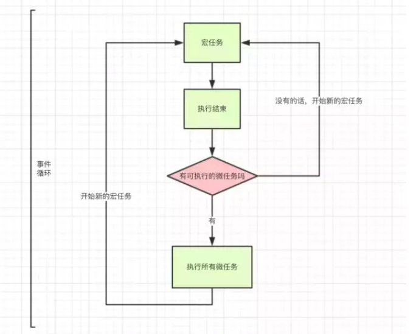

消息队列

ES6引入的任务队列，用于promise

出现**Promises**后，异步任务就出现了优先级，浏览器中，可以按性质把任务分为两类，macrotask（宏任务）和 microtask（微任务）。

- **macrotask**（按优先级顺序排列）: `script`(你的全部JS代码，“同步代码”）, `setTimeout`, `setInterval`, `setImmediate`, `I/O`,`UI rendering`
- **microtask**（按优先级顺序排列）:`process.nextTick`,`Promises`（这里指浏览器原生实现的 Promise）, `Object.observe`, `MutationObserver`
- js引擎首先从macrotask queue中取出第一个任务，执行完毕后，将microtask queue中的所有任务取出，按顺序全部执行；
- 然后再从**macrotask queue**（宏任务队列）中取下一个，执行完毕后，再次将**microtask queue**（微任务队列）中的全部取出；
- 循环往复，直到两个queue中的任务都取完。



知道了上面的流程后，如下代码：

```
console.log('1');
setTimeout(function() {
  console.log('2');
  new Promise(function(resolve) {
      console.log('3');
      resolve();
  }).then(function() {
      console.log('4')
  })
})
console.log('5');
setTimeout(function() {
  console.log('6');
  new Promise(function(resolve) {
      console.log('7');
      resolve();
  }).then(function() {
      console.log('8')
  })
})
console.log('9');
// 1 5 9 2 3 6 7 4 8
```

上面代码执行过程：

- 第一轮事件循环
  - 整体script作为第一个宏任务进入主线程，遇到`console.log`，输出1
  - 遇到`setTimeout`,其回调函数被放到`宏任务队列`中，暂记为`setTmineout1`
  - 遇到`console.log`，输出5
  - 遇到`setTimeout`,其回调函数被放到`宏任务队列`中，暂记为`setTmineout2`
  - 遇到`console.log`，输出9
  - 一个宏任务执行结束，去`微任务队列`查找是否有待执行的任务，没有，结束
  - 第一轮循环结束，输出：`1 5 9`
- 第二轮事件循环
  - 从宏任务队列中取出一个任务，即`setTmineout1`，开始执行
  - 遇到`console.log`，输出2
  - 遇到`Promise`,创建`Promise`,输出了3,同时把`Promise.then`回调函数放到`微任务队列`
  - 一个宏任务执行结束，去`微任务队列`查找是否有待执行的任务, 发现有微任务，全部取出放到执行栈执行
  - 执行微任务，此时就一个微任务，`console.log`，输出4
  - 微任务执行结束
  - 第二轮循环结束，输出：`2 4`
- 第三轮事件循环与第二轮一样，输出：`6 7 8`
- 全部的输出：`1 5 9 2 3 4 6 7 8`,可复制代码到`chrome`浏览器控制台中运行校验结果


## node 测试


```
console.log('1')
setTimeout(function() {
  console.log('2')
  new Promise(function(resolve) { console.log('4'); resolve(); })
  .then(function() { console.log('5') })
  setTimeout(() => { console.log('6') })
  new Promise(function(resolve) { console.log('7'); resolve()})
  .then(function() { console.log('8') })
})
setTimeout(function() { console.log('9') }, 0)
new Promise(function(resolve) { console.log('10'); resolve() })
.then(function() { console.log('11') })
setTimeout(function() {
  console.log('12')
  new Promise(function(resolve) { console.log('13'); resolve() })
  .then(function() {  console.log('14') })
})
new Promise(function(resolve) { console.log('15'); resolve() })
.then(function() { console.log('16') })

// node
// 1 10 15 2 4 7 9 11 12 13 16 5 6 8 14

// 浏览器
// 1 10 15 11 16 2 4 7 5 8 9 12 13 14 6
```

https://segmentfault.com/a/1190000012648569

https://segmentfault.com/a/1190000012362096


https://blog.csdn.net/i10630226/article/details/81369841

https://juejin.im/post/5af1413ef265da0b851cce80