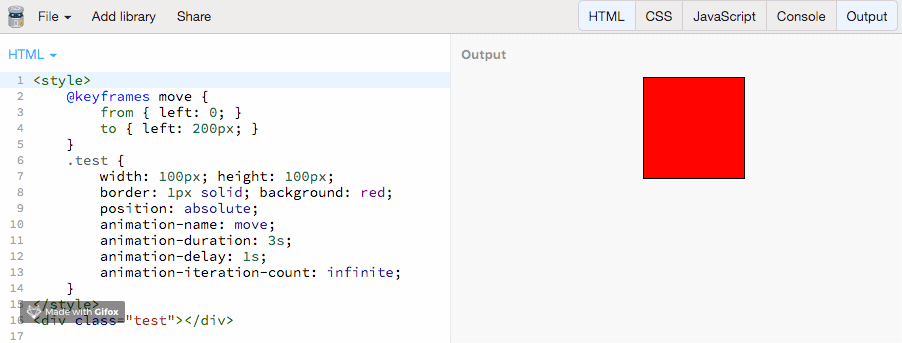
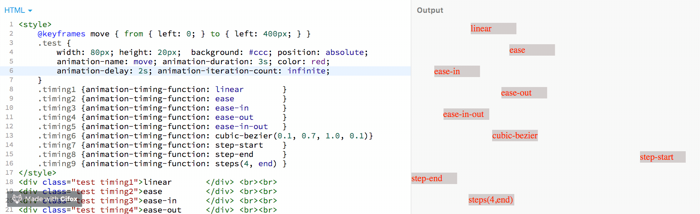
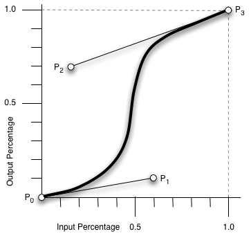

[TOC]

# Transition、Transform和Animation

这三个属性都是CSS3版本的属性，所以会有兼容性问题。

## 1. Transition:过度

过渡`transition`是一个复合属性，包括`transition-property`,`transition-duration`，`transition-timing-function`，`transtion-delay`四个子属性。通过四个子属性配合完成过度效果。

Internet Explorer 10、Firefox、Opera 和 Chrome 支持 transition 属性。
Safari 支持替代的 -webkit-transition 属性。
注释：Internet Explorer 9 以及更早版本的浏览器不支持 transition 属性。

### 1.1 transition-property:过渡的属性
  过渡的属性的名称，比如 transition-property:backgrond 就是指 backgound 参与这个过渡
  值：none(没有指定任何样式)、 all(默认值，指定元素所有支持transition-property属性的样式)、` <transition-property>`(可选过度样式)
  适用于：所有元素
  继承性：无

不是所有的CSS样式都可以过渡，只有具有中间值的属性才有过渡效果。

```
颜色：color background-color border-color outline-color
位置：background-position left right top botton
长度：
    [1]max-height min-height max-width min-width height width
    [2]border-width margin padding outline-width outline-offset
    [3]font-size line-height text-indent vertical-align  
    [4]border-spacing letter-spacing word-spacing
数字: opacity visibility z-index font-weight zoom
组合: text-shadow transform box-shadow clip
其他: gradient
```


### 1.2 transition-duration:过渡持续时间

定义过渡效果花费的时间,默认是 0
该属性单位是 秒（s）或者毫秒（ms），该属性必须带单位，如果为0s则为默认值，如为0则为无效值。
该值为单值时，所有的过渡属性都对应同样时间；该值为多值时，过渡属性按照顺序对应顺序时间

### 1.3 transition-timing-function:过渡时间函数

规定过渡效果的时间曲线,用于指定过渡类型，
初始值ease，

  ```
  ease:开始和结束慢，中间快。
  linear：匀速
  ease-in：开始慢
  ease-out: 结束慢
  ease-in-out：和ease类似，但比ease幅度大
  step-start:直接位于结束处
  step-end:位于开始处经过时间间隔后结束。
  ```

### 1.4 transition-delay:过渡延迟时间
规定过渡效果何时开始。默认值是 0s。用于制定延迟过渡的时间，该属性单位是秒（s）或毫秒（ms）

**【注意】**该属性必须带单位，0s为默认值，0则为无效值。若该属性为负值，无延迟效果，但过渡元素的起始值将从0变成设定值（*设定值=延迟时间+持续时间*），若该设定值小于等于0；则无过渡效果；若该设定值大于0，则过渡元素从该设定值开始完成剩余的过渡效果

### 1.5 实际代码例子

```less
 .box {
  width: 100px;
  height: 100px;
  background: red;
  transition: width 2s;
  -weikit-transition: width 2s; /* Safari*/
}
.box:hover {
  width: 400px;
}
```

上面的代码在鼠标放入后div的宽会在2秒内变宽到400px。

[在线代码](http://js.jirengu.com/xadub/1/edit)

其他用法

```less
/* 设置不同的transition-property，对应的transition-delay，transition-timing-function，transition-duration的属性相同时，设置一个即可。*/
.test1 {
  transition-property:width,background;
  transition-duration:3s;
  transition-timing-function:ease;
  transition-delay:500ms;
}
/*相当于*/
.test1 {
  transition:width 3s ease 500ms,background 3s ease 500ms;
}

/* 当transition-property的值的个数多余对应的其他属性时（属性值大于1个），则按顺序取值。*/
.test{
  transition-property:width,background,opacity;
  transition-duration:2s,500ms;
  transition-timing-function:linera,ease;
  transition-delay:200ms,4s;
}
/*相当于*/
.test1{
  transition:width 2s linera 200ms, background 500ms ease 4s,opacity 2s linera 200ms;
}

// 当transition-property值的个数少于对应的其他属性，则多余的属性无效。
.test1{
    transition-property: width;
    transition-duration: 2s,500ms;
    transition-timing-function: linear,ease;
    transition-delay: 200ms,0s;
}
/*类似于*/
.test1{
    transition: width 2s linear 200ms;
}

// 当transition-property的值中出现一个无效值，它依然按顺序对transition的其他属性值（其他属性出现无效值，处理情况也类似）
.test1{
    transition-property: width,wuxiao,background;
    transition-duration: 2s,500ms;
    transition-timing-function: linear,ease;
    transition-delay: 200ms,0s;
}
/*类似于*/
.test2{
    transition: width 2s linear 200ms,background 2s linear 200ms;
}

// 当transition-property的值中，有些值重复出现多次，则以最后出现的值为准，前面所有出现的值都被认定为无效值，但依然按顺序对应transition的其他属性值
.test1{
    transition-property: width,width,background;
    transition-duration: 2s,500ms;
    transition-timing-function: linear,ease;
    transition-delay: 200ms,0s;
}
/*类似于*/
.test2{
    transition: width 500ms ease 0s,background 2s linear 200ms;
}

```

参考资料：https://www.jianshu.com/p/5dbeeb2159e8

## 2. Transform:变形

参考资料：https://www.cnblogs.com/aspnetjia/p/5139020.html

指拉伸，压缩，旋转，偏移等等一些图形学里面的基本变换。这是通过修改CSS视觉格式化模型的坐标空间来实现的。

只能转换由盒子模型定位的元素。根据经验，如果元素具有`display: block`，则由盒模型定位元素。

`skew`是倾斜，`scale`是缩放，`rotate`是旋转，`translate`是平移。最后需要说明一点，transform 支持综合变换。

以如下代码为例，讲解这几个属性作用：

```html
<style>
    .one {
        width: 200px;
        height: 200px;
        background-color: red;
        transition: transform 1s linear;
    }
</style>
<div class="one"></div>
```

### 2.1 旋转:rotate

```CSS
.one:hover {
  transform: rotate(45deg);
}
```

共一个参数“角度”，单位deg为度的意思，正数为顺时针旋转，负数为逆时针旋转，上述代码作用是顺时针旋转45度。

### 2.2 缩放:scale

```less
.one:hover {
  transform: scale(0.5);
  // transform: scale(0.5, 2); 或者这样用
}
```

参数表示缩放倍数；

- 一个参数时：表示水平和垂直同时缩放该倍率
- 两个参数时：第一个参数指定水平方向的缩放倍率，第二个参数指定垂直方向的缩放倍率。

### 2.3 倾斜:skew

用法：

```less
.one:hover {
  /* transform: skewX(30deg);  X轴(水平)倾斜30度*/
  /* transform: skewy(30deg); Y轴(垂直)倾斜30度*/
  transform: skew(30deg); /* X轴(水平)倾斜30度 */
  /* transform: skew(30deg, 30deg); X轴(水平)倾斜30度, Y轴(垂直)倾斜30度*/ 
}
```

参数表示倾斜角度，单位deg

- 一个参数时：表示水平方向的倾斜角度；
- 两个参数时：第一个参数表示水平方向的倾斜角度，第二个参数表示垂直方向的倾斜角度。

### 2.4 移动:translate

用法：

```less
.one:hover {
  /* transform: translate(45px); 水平右移45px*/
  /* transform: translate(45px, 45px); 水平右移45px, 垂直下移45px*/
  /* transform: translateX(45px); 水平右移45px*/
  transform: translateY(45px); /* 垂直下移45px*/
}
```

参数表示移动距离，单位px，

- 一个参数时：表示水平方向的移动距离；
- 两个参数时：第一个参数表示水平方向的移动距离，第二个参数表示垂直方向的移动距离。

### 2.5 基准点: transform-origin

在使用transform方法进行文字或图像的变形时，是以元素的中心点为基准点进行的。使用transform-origin属性，可以改变变形的基准点。

```less
.one:hover {
  transform-origin: 10px 10px;
}
```

共两个参数，表示相对左上角原点的距离，单位px，第一个参数表示相对左上角原点水平方向的距离，第二个参数表示相对左上角原点垂直方向的距离；

两个参数除了可以设置为具体的像素值，其中第一个参数可以指定为left、center、right，第二个参数可以指定为top、center、bottom。

### 2.6 多个方法组合使用

用法：

```less
.one:hover {
  transform: rotate(45deg) scale(0.5) skew(30deg, 30deg) translate(100px, 100px);
}
```

这四种变形方法顺序可以随意，但不同的顺序导致变形结果不同，原因是变形的顺序是从左到右依次进行，这个用法中的执行顺序为1.rotate  2.scalse  3.skew  4.translate


## 3. Animation:动画

**CSS animations** 使得可以将从一个CSS样式配置转换到另一个CSS样式配置。

动画包括两个部分:

- 描述动画的样式规则
- 用于指定动画开始、结束以及中间点样式的关键帧。

相较于传统的脚本实现动画技术，使用CSS动画有三个主要优点：

1. 能够非常容易地创建简单动画，你甚至不需要了解JavaScript就能创建动画。
2. 动画运行效果良好，甚至在低性能的系统上。渲染引擎会使用跳帧或者其他技术以保证动画表现尽可能的流畅。而使用JavaScript实现的动画通常表现不佳（除非经过很好的设计）。
3. 让浏览器控制动画序列，允许浏览器优化性能和效果，如降低位于隐藏选项卡中的动画更新频率。

### 3.1 @keyframes:关键帧

[CSS3中的关键帧 MDN](https://developer.mozilla.org/zh-CN/docs/Web/CSS/@keyframes)

@keyframes是定义动画的表现。
要使用关键帧, 先创建一个带名称的`@keyframes`规则，以便后续使用 [`animation-name`](https://developer.mozilla.org/zh-CN/docs/Web/CSS/animation-name) 这个属性来将一个动画同其关键帧声明匹配。每个`@keyframes` 规则包含多个关键帧，也就是一段样式块语句，每个关键帧有一个百分比值作为名称，代表在动画进行中，在哪个阶段触发这个帧所包含的样式。
您可以按任意顺序列出关键帧百分比；他们将按照其应该发生的顺序来处理。

例子：

```css
@keyframes slidein {
  from { 
    margin-left: 100%; width: 300%; 
  }
  to { margin-left: 0%; width: 100%; }
}
/* 如果一个关键帧中没有出现其他关键帧中的属性，那么这个属性将使用插值(不能使用插值的属性除外, 这些属性会被忽略掉)。例如： */
@keyframes identifier {
  0% { top: 0; left: 0; }
  30% { top: 50px; }
  68%, 72% { left: 50px; }
  100% { top: 100px; left: 100%; }
}
```

1、命名规范

由大小写不敏感的字母a-z、数字0-9、下划线(_)和/或横线(-)组成。第一个非横线字符必须是字母，数字不能在字母前面，不允许两个横线出现在开始位置。来自 [animation-name MDN](https://developer.mozilla.org/zh-CN/docs/Web/CSS/animation-name)

命名尽量不要与animation其他属性的变量重名，否则在使用时候会和其他属性冲突。

```javascript
// 命名需要遵循以下规则
const rIsInvalid = /^--|^[0-9]+-|^(?:unset|initial|inherit|none)$/
    , rIsValid = /^[0-9a-z-_\\]+$/i
function isValidAnimationName(animationName: string): boolean{
  return !rIsInvalid.test(animationName) && rIsValid(animationName)
}
```

2、`<Animation Time Offset>` 关键帧时间点的取值

关键帧使用百分比来指定动画发生的时间点。`0%`表示动画的第一时刻，`100%`表示动画的最终时刻。因为这两个时间点十分重要，所以还有特殊的别名：`from(0%)`和`to(100%)`。这两个都是可选的，若`from`或`to`未指定，则浏览器使用计算值开始或结束动画。也可包含额外可选的关键帧，描述动画开始和结束之间的状态。

3、@keyframes的名字重复怎么办
@keyframes CSS规则不支持层叠样式，因此当出现多个同名keyframes，那么仅最后出现的那个有效。

```css
/* 无效 */
@keyframes rotate {
  from { transform: rotate(0deg); }
  to { transform: rotate(360deg); }
}
/* 生效 */
@keyframes rotate {
  from { transform: rotate(90deg); }
  to { transform: rotate(-360deg); }
}
```

4、关键帧时间点重复怎么办
与@keyframes CSS规则一样，标准规定相同的关键帧不产生层叠，仅最后出现的认定为有效。
但实际上FireFox14+和Chrome均将关键帧设计为可层叠的。
为避免出错，最好不好写重复的关键帧时间点。

```css
@keyframes rotate {
  from { transform: rotate(0deg); }
  from { background: red; }
  /* 上述两条time offset实际上等价于  from { transform: rotate(0deg); background: red; } */
  to {
    transform: rotate(360deg);
    background: yellow;
  }
}
```

5、`!important`导致属性失效
一般情况下使用`!important`会让CSS属性获得最高权重，但在@keyframes下却会导致该CSS属性失效。

```less
@keyframes rotate {
  from {
    transform: rotate(90deg);
    background: red!important; /* background属性无效 */
  }
  to { transform: rotate(-360deg); }
}
```

6、必须提供至少两个关键帧

```less
/* 不会根据缓动函数产生动画效果，而是在动画持续时间的最后瞬间移动过去 */
@keyframes move-left{
   to {
       left: 100px;
   }
}
```

### 3.2 配置动画效果

创建动画序列，需要使用[`animation`](https://developer.mozilla.org/zh-CN/docs/Web/CSS/animation)属性或其子属性，该属性允许配置动画时间、时长以及其他动画细节，但该属性不能配置动画的实际表现，动画的实际表现是由 [`@keyframes`](https://developer.mozilla.org/zh-CN/docs/Web/CSS/@keyframes)规则实现， 

#### 3.2.1 animation-name、animation-duration、animation-delay

- animation-name

  属性指定应用的一系列动画，每个名称代表一个由[`@keyframes`](https://developer.mozilla.org/zh-CN/docs/Web/CSS/@keyframes)定义的动画序列。

  默认值为none

- animation-duration

  一个动画周期的时长，单位为秒(s)或者毫秒(ms)，无单位值无效。

  默认值为0s，表示无动画。

- animation-delay

  定义动画于何时开始，即从动画应用在元素上到动画开始的这段时间的长度。该值可用单位为秒(s)和毫秒(ms)。如果未设置单位，定义无效。

  默认值为0s，代表动画在应用到元素上后立即开始执行。

上面三个属性代码例子：

```html
<style>
    @keyframes move {
        from { left: 0; }
        to { left: 200px; }
    }
    .test {
        width: 100px; height: 100px; border: 1px solid; background: red;
        position: absolute;
        animation-name: move;
        animation-duration: 3s;
        animation-delay: 1s;
        animation-iteration-count: infinite;	/*无限循环播放动画，下面有讲解*/
    }
</style>
<div class="test"></div>
```

https://jsbin.com/kegefuh/5/edit?html,output



#### 3.2.2 animation-timing-function

animation-timing-function属性定义CSS动画在每一动画周期中执行的节奏。

可选的值：
linear、ease、ease-in、ease-ou、ease-in-ou、
steps(4, end)、step-start、step-end
cubic-bezier(0.1, 0.7, 1.0, 0.1)

代码示例：

```html
<style>
    @keyframes move { from { left: 0; } to { left: 400px; } }
    .test {
        width: 80px; height: 20px;  background: #ccc; position: absolute;
        animation-name: move; animation-duration: 3s; color: red;
        animation-delay: 2s; animation-iteration-count: infinite;
    }
    .timing1 {animation-timing-function: linear        } /*从开始到结束都是匀速运动*/
    .timing2 {animation-timing-function: ease          } /*开始慢，中间块，最后慢*/
    .timing3 {animation-timing-function: ease-in       } /*动画以低速开始*/
    .timing4 {animation-timing-function: ease-out      } /*动画以低速结束*/
    .timing5 {animation-timing-function: ease-in-out   } /*动画以低速开始和结束*/
    .timing6 {animation-timing-function: cubic-bezier(0.1, 0.7, 1.0, 0.1)}
    .timing7 {animation-timing-function: step-start    } /*直接在终点不变*/
    .timing8 {animation-timing-function: step-end      } /*直接在开始不变*/
    .timing9 {animation-timing-function: steps(4, end) } /*分4次跳跃*/
</style>
<div class="test timing1">linear       </div> <br><br>
<div class="test timing2">ease         </div> <br><br>
<div class="test timing3">ease-in      </div> <br><br>
<div class="test timing4">ease-out     </div> <br><br>
<div class="test timing5">ease-in-out  </div> <br><br>
<div class="test timing6">cubic-bezier </div> <br><br>
<div class="test timing7">step-start   </div> <br><br>
<div class="test timing8">step-end     </div> <br><br>
<div class="test timing9">steps(4,end) </div> <br><br>
```



在线代码查看：https://jsbin.com/kegefuh/8/edit?html,output

- 关于cubic-bezier(0.1, 0.7, 1.0, 0.1)

  cubic-bezier定义了一条立方贝塞尔曲线，这些曲线是连续的，一般用于动画的平滑变换，也被称为缓动函数（*easing functions*）。

  一条立方贝塞尔曲线需要四个点来定义，如下图，P0 、P1 、P2 和 P3。P0 和 P3 是起点和终点，这两个点被作为比例固定在坐标系上，横轴为时间比例，纵轴为完成状态。P0 是 `(0, 0)，表示初始时间和初始状态。`P3 是 `(1, 1)` ，表示终止时间和终止状态。

  P1的坐标(x,y)对应了`cubic-bezier(n,n,n,n)`的前两个n值，P2坐标对应了后两个n值。cubic-bezier函数根据P1、P2两个点就能画出一条曲线，这条曲线就是动画运动的轨迹。

  cubic-bezier的几个特定值：

  cubic-bezier(.25, .1, .25, 1): ease

  cubic-bezier(0, 0, 1, 1)      :liner (或者cubic-bezier(1, 1, 0, 0))

  cubic-bezier(.42, 0, 1, 1)   : ease-in

  cubic-bezier(0, 0, .58, 1)   : ease-out

  cubic-bezier(.42, 0, .58, 1) : ease-in-out

  linear、ease、ease-in、ease-ou、ease-in-ou这些变量是cubic-bezier的特定值下的表现。

  ***注意：***P1、P2的横坐标都在[0,1]范围内时，三次贝塞尔曲线才是是有效的。

  一个在线网站可以在线画出曲线测试，方便自定义动画运动轨迹：https://cubic-bezier.com/

  

- 关于steps(4,end)

  steps()是一个timing function(定时函数)，允许我们将动画或者过渡分割成段，而不是从一种状态持续到另一种状态的过渡。

  语法：steps(number_of_steps, direction)

  第一个参数(number_of_steps):一个正整数，表示一个动画周期分割的段数

  第二个参数(direction):表示在一个分割的段数时间内，物体应该在的位置，该参数有2个选项，`start`、`end`，默认值是`end`，

  `start`表示在动画开始时，动画的第一段将会马上完成。以左侧端点为起点，立即跳到第一个step的结尾处。它会立即跳到第一段的结束并且保持这样的状态直到第一步的持续时间结束。后面的每一帧都将按照此模式来完成动画。

  `end`表示动画执行时，在每一帧里，动画保持当前状态直到这一段的持续时间完成，才会跳到下一步的起点，后面的每一帧都按照这个模式来进行，在最后一帧的起点，等到这一帧的持续时间结束，整个动画的执行也已经结束，执行动画的元素来不及跳到这一帧的终点，直接回到了整个动画起点，

  https://jsbin.com/kegefuh/14/edit?html,output

  


[animation-timing-function知识点以及属性值steps()详解](https://blog.csdn.net/qq_23269747/article/details/76152689)

[timing-function](https://developer.mozilla.org/zh-CN/docs/Web/CSS/timing-function)

#### 3.2.3 animation-iteration-count、animation-fill-mode

`<animation-iteration-count>`，动画重复播放次数，默认为1，infinite表示无限循环

`<animation-fill-mode>`，可选值为`none | forwards | backwards | both`，用于设置动画开始前和结束后是否应用`0%`和`100%`的样式对元素上。分别表示`不应用`，`应用100%的样式`，`延迟播放期间应用0%的样式`和`0%和100%的样式均应用`。

#### 3.2.4 animation-direction、animation-play-state

`<animation-direction>`，可选值为`normal | reverse | alternate | alternate-reverse`，分别表示动画播放顺序是`从from到to`，`从to到from`，`从from到to再从to到from`和`从to到from再从from到to`。**注意：设置alternate|alternate-reverse时，animation-iteration-count必须大于1才能看到效果**

`<animation-play-state>`，可选值`running | paused`，获取和设置播放状态。**注意：通过这个属性，我们仅能实现暂停和继续播放的效果，无法实现重播，更别说回放了**

#### 3.2.1 animation

 **animation** 属性是 [`animation-name`](https://developer.mozilla.org/zh-CN/docs/Web/CSS/animation-name)，[`animation-duration`](https://developer.mozilla.org/zh-CN/docs/Web/CSS/animation-duration), [`animation-timing-function`](https://developer.mozilla.org/zh-CN/docs/Web/CSS/animation-timing-function)，[`animation-delay`](https://developer.mozilla.org/zh-CN/docs/Web/CSS/animation-delay)，[`animation-iteration-count`](https://developer.mozilla.org/zh-CN/docs/Web/CSS/animation-iteration-count)，[`animation-direction`](https://developer.mozilla.org/zh-CN/docs/Web/CSS/animation-direction)，[`animation-fill-mode`](https://developer.mozilla.org/zh-CN/docs/Web/CSS/animation-fill-mode) 和 [`animation-play-state`](https://developer.mozilla.org/zh-CN/docs/Web/CSS/animation-play-state) 属性的一个简写属性形式。

`animation` 属性用来指定一组或多组动画，每组之间用逗号相隔。

```
animation:
[animation-name] [animation-duration] // 动画的名称、持续时间
[animation-timing-function][animation-delay] // 关于时间的函数(properties/t)、延迟时间
[animation-iteration-count] [animation-direction] // 播放次数、播放顺序
[animation-fill-mode] [animation-play-state]; // 播放前或停止后设置相应样式、控制动画运行或暂停
```

示例：

```less
.box.rotate {
  animation: rotate 10s infinite alternate;
}
```


## 4. 参考资料

[深入理解CSS过渡属性transition 简书](https://www.jianshu.com/p/5dbeeb2159e8)

[CSS3属性transform详解](https://www.cnblogs.com/aspnetjia/p/5139020.html)

[CSS3（三）Animation 入门详解 CSDN](https://blog.csdn.net/u013243347/article/details/79976352)

[CSS Animations MDN](https://developer.mozilla.org/zh-CN/docs/Web/CSS/CSS_Animations)

[使用 CSS 动画 MDN](https://developer.mozilla.org/zh-CN/docs/Web/CSS/CSS_Animations/Using_CSS_animations)

[CSS3中的关键帧 MDN](https://developer.mozilla.org/zh-CN/docs/Web/CSS/@keyframes)

[CSS魔法堂：更丰富的前端动效by CSS Animation 来自segmentfault](https://segmentfault.com/a/1190000015588193)

[时间函数 `cubic-bezier` 在线网站](https://cubic-bezier.com/)

[`cubic-bezier` 中文版在线网站](http://yisibl.github.io/cubic-bezier/#.55,.49,.83,.67)

[【译】css动画里的steps()用法详解](https://segmentfault.com/a/1190000007042048)