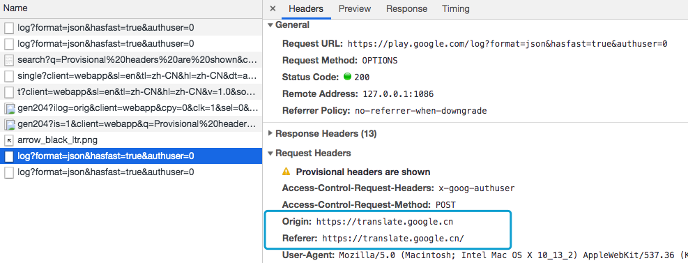

# CSRF攻击

## 1. 什么是CSRF

CSRF（Cross-site request forgery）跨站请求伪造：攻击者诱导受害者进入第三方网站，在第三方网站中，向被攻击网站发送跨站请求。利用受害者在被攻击网站已经获取的注册凭证，绕过后台的用户验证，达到冒充用户对被攻击的网站执行某项操作的目的。

一个典型的CSRF攻击有着如下的流程：

- 受害者登录a.com，并保留了登录凭证（Cookie）。
- 攻击者引诱受害者访问了b.com。
- b.com 向 a.com 发送了一个请求：a.com/act=xx。浏览器会默认携带a.com的Cookie。
- a.com接收到请求后，对请求进行验证，并确认是受害者的凭证，误以为是受害者自己发送的请求。
- a.com以受害者的名义执行了act=xx。
- 攻击完成，攻击者在受害者不知情的情况下，冒充受害者，让a.com执行了自己定义的操作。

CSRF的特点:

- 攻击一般发起在第三方网站，而不是被攻击的网站。被攻击的网站无法防止攻击发生。
- 攻击利用受害者在被攻击网站的登录凭证，冒充受害者提交操作；而不是直接窃取数据。
- 整个过程攻击者并不能获取到受害者的登录凭证，仅仅是“冒用”。
- 跨站请求可以用各种方式：图片URL、超链接、CORS、Form提交等等。部分请求方式可以直接嵌入在第三方论坛、文章中，难以进行追踪。

CSRF通常是跨域的，因为外域通常更容易被攻击者掌控。但是如果本域下有容易被利用的功能，比如可以发图和链接的论坛和评论区，攻击可以直接在本域下进行，而且这种攻击更加危险。

### 1.1 几种常见的攻击类型

#### 1.1.1 GET类型的CSRF

GET类型的CSRF利用非常简单，只需要一个HTTP请求，一般会这样利用：

```html

```

在受害者访问含有这个img的页面后，浏览器会自动向`http://bank.example/withdraw?account=xiaoming&amount=10000&for=hacker`发出一次HTTP请求。bank.example就会收到包含受害者登录信息的一次跨域请求。

#### 1.1.2 POST类型的CSRF

这种类型的CSRF利用起来通常使用的是一个自动提交的表单，如：

```html
<form action="http://bank.example/withdraw" method=POST>
    <input type="hidden" name="account" value="xiaoming" />
    <input type="hidden" name="amount" value="10000" />
    <input type="hidden" name="for" value="hacker" />
</form>
<script> document.forms[0].submit(); </script> 
```

访问该页面后，表单会自动提交，相当于模拟用户完成了一次POST操作。

POST类型的攻击通常比GET要求更加严格一点，但仍并不复杂。任何个人网站、博客，被黑客上传页面的网站都有可能是发起攻击的来源，后端接口不能将安全寄托在仅允许POST上面。

#### 1.1.3 链接类型的CSRF

链接类型的CSRF并不常见，比起其他两种用户打开页面就中招的情况，这种需要用户点击链接才会触发。这种类型通常是在论坛中发布的图片中嵌入恶意链接，或者以广告的形式诱导用户中招，攻击者通常会以比较夸张的词语诱骗用户点击，例如：

```html
 <a href="http://test.com/csrf/withdraw.php?amount=1000&for=hacker" taget="_blank">
  重磅消息！！
  <a/>
```

由于之前用户登录了信任的网站A，并且保存登录状态，只要用户主动访问上面的这个PHP页面，则表示攻击成功。

## 2. CSRF防护策略

CSRF的两个特点：

- CSRF（通常）发生在第三方域名。
- CSRF攻击者不能获取到Cookie等信息，只是使用。

针对这两点，我们可以专门制定防护策略，如下：

- 阻止不明外域的访问
  - 同源检测
  - Samesite Cookie
- 提交时要求附加本域才能获取的信息
  - CSRF Token
  - 双重Cookie验

### 2.1 阻止不明外域的访问

#### 2.1.1 同源检测

既然CSRF大多来自第三方网站，那么我们就直接禁止外域（或者不受信任的域名）对我们发起请求。

那么问题来了，我们如何判断请求是否来自外域呢？

在HTTP协议中，每一个异步请求都会携带两个Header，用于标记来源域名：

- Origin Header
- Referer Header



截图的是Google翻译网站：https://translate.google.cn/

这两个Header在浏览器发起请求时，大多数情况会自动带上，并且不能由前端自定义内容。
服务器可以通过解析这两个Header中的域名，确定请求的来源域。

##### 2.1.1.1 使用Origin Header确定来源域名

在部分与CSRF有关的请求中，请求的Header中会携带Origin字段。字段内包含请求的域名（不包含path及query）。
如果Origin存在，那么直接使用Origin中的字段确认来源域名就可以。
但是Origin在以下两种情况下并不存在：

- **IE11同源策略：** IE 11 不会在跨站CORS请求上添加Origin标头，Referer头将仍然是唯一的标识。最根本原因是因为IE 11对同源的定义和其他浏览器有不同，有两个主要的区别，可以参考[MDN Same-origin_policy#IE_Exceptions](https://developer.mozilla.org/en-US/docs/Web/Security/Same-origin_policy#IE_Exceptions)
- **302重定向：** 在302重定向之后Origin不包含在重定向的请求中，因为Origin可能会被认为是其他来源的敏感信息。对于302重定向的情况来说都是定向到新的服务器上的URL，因此浏览器不想将Origin泄漏到新的服务器上。

##### 2.1.1.2 使用Referer Header确定来源域名

根据HTTP协议，在HTTP头中有一个字段叫Referer，记录了该HTTP请求的来源地址。
对于Ajax请求，图片和script等资源请求，Referer为发起请求的页面地址。对于页面跳转，Referer为打开页面历史记录的前一个页面地址。因此我们使用Referer中链接的Origin部分可以得知请求的来源域名。

这种方法并非万无一失，Referer的值是由浏览器提供的，虽然HTTP协议上有明确的要求，但是每个浏览器对于Referer的具体实现可能有差别，并不能保证浏览器自身没有安全漏洞。使用验证 Referer 值的方法，就是把安全性都依赖于第三方（即浏览器）来保障，从理论上来讲，这样并不是很安全。在部分情况下，攻击者可以隐藏，甚至修改自己请求的Referer。

2014年，W3C的Web应用安全工作组发布了Referrer Policy草案，对浏览器该如何发送Referer做了详细的规定。截止现在新版浏览器大部分已经支持了这份草案，我们终于可以灵活地控制自己网站的Referer策略了。新版的Referrer Policy规定了五种Referer策略：No Referrer、No Referrer When Downgrade、Origin Only、Origin When Cross-origin、和 Unsafe URL。之前就存在的三种策略：never、default和always，在新标准里换了个名称。他们的对应关系如下：

| 策略名称                   | 属性值（新）                     | 属性值（旧） |
| :------------------------- | :------------------------------- | :----------- |
| No Referrer                | no-Referrer                      | never        |
| No Referrer When Downgrade | no-Referrer-when-downgrade       | default      |
| Origin Only                | (same or strict) origin          | origin       |
| Origin When Cross Origin   | (strict) origin-when-crossorigin | -            |
| Unsafe URL                 | unsafe-url                       | always       |

根据上面的表格因此需要把Referrer Policy的策略设置成same-origin，对于同源的链接和引用，会发送Referer，referer值为Host不带Path；跨域访问则不携带Referer。例如：`aaa.com`引用`bbb.com`的资源，不会发送Referer。

设置Referrer Policy的方法有三种：

1. 在CSP设置
2. 页面头部增加meta标签
3. a标签增加referrerpolicy属性

上面说的这些比较多，但我们可以知道一个问题：攻击者可以在自己的请求中隐藏Referer。如果攻击者将自己的请求这样填写：

```html

```

那么这个请求发起的攻击将不携带Referer。

另外在以下情况下Referer没有或者不可信：

1、IE6、7下使用window.location.href=url进行界面的跳转，会丢失Referer。

2、IE6、7下使用window.open，也会缺失Referer。

3、HTTPS页面跳转到HTTP页面，所有浏览器Referer都丢失。

4、点击Flash上到达另外一个网站的时候，Referer的情况就比较杂乱，不太可信。

#### 2.1.2 无法确认来源域名情况

当Origin和Referer头文件不存在时该怎么办？如果Origin和Referer都不存在，建议直接进行阻止，特别是如果您没有使用随机CSRF Token（参考下方）作为第二次检查。

#### 2.1.3 阻止外域请求


## 参考资料

https://segmentfault.com/a/1190000016659945